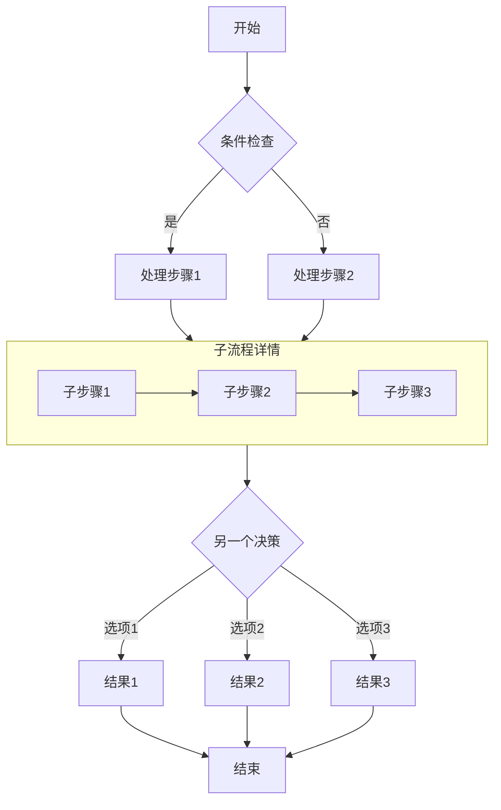
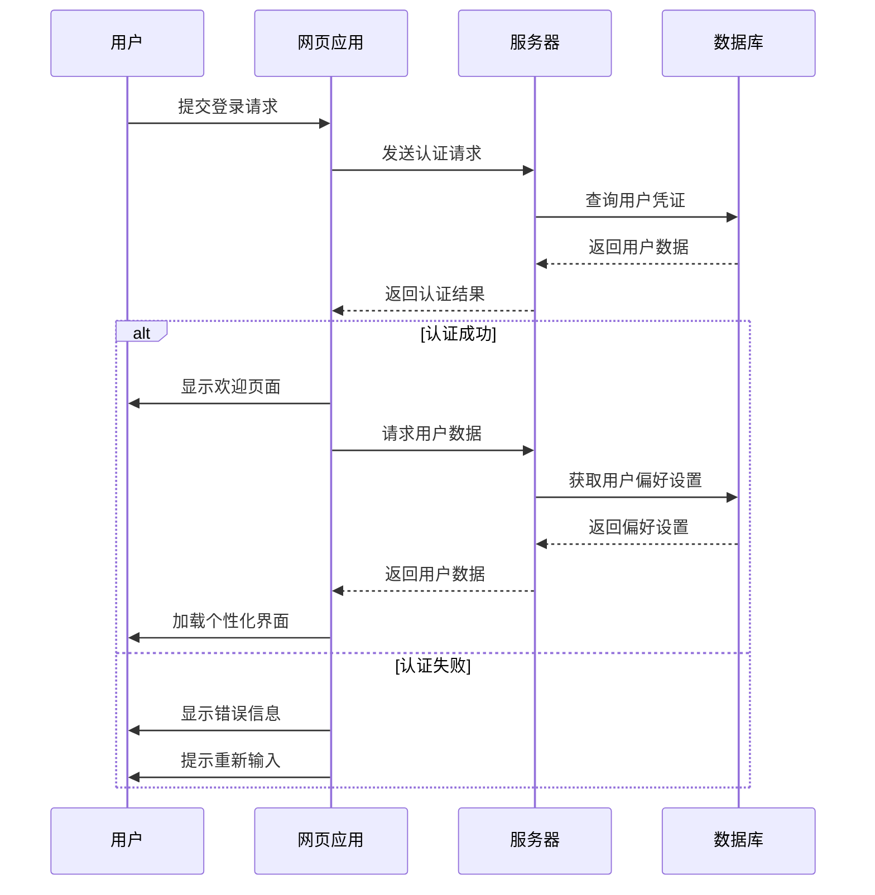
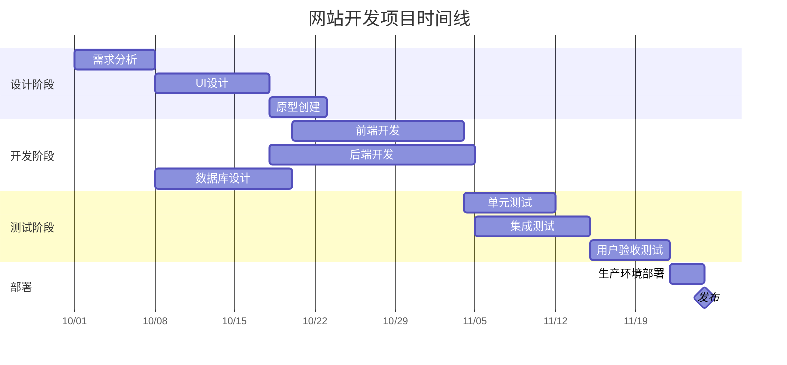
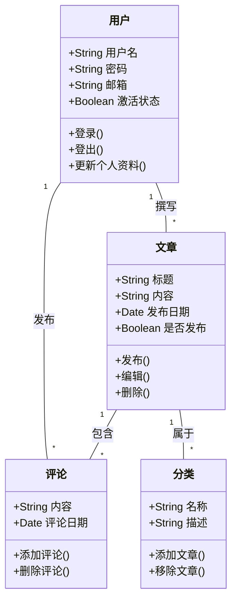
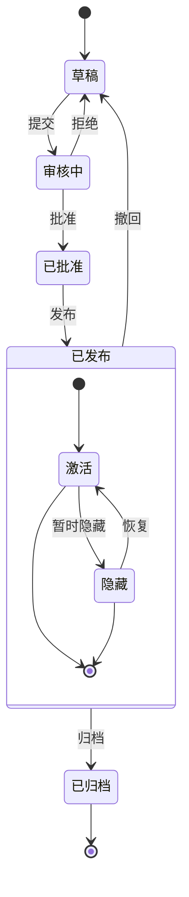
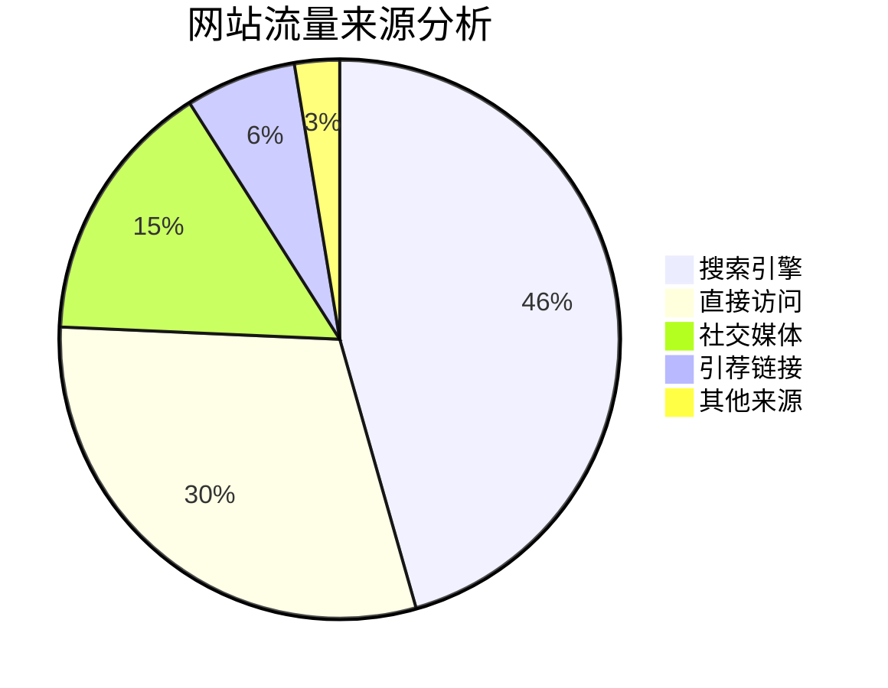

# Markdown与Mermaid图表完全指南

本文演示了如何在Markdown文档中使用Mermaid创建各种复杂图表，包括流程图、序列图、甘特图、类图和状态图。

## 流程图示例

流程图非常适合表示过程或算法步骤。

## 序列图示例

序列图展示对象之间随时间的交互。

## 甘特图示例

甘特图非常适合显示项目计划和时间表。

## 类图示例

类图展示系统的静态结构，包括类、属性、方法及其关系。

## 状态图示例

状态图展示对象在其生命周期中经历的状态序列。

## 饼图示例

饼图非常适合显示比例和百分比数据。

## 结论

Mermaid是一个强大的工具，可以在Markdown文档中创建各种类型的图表。本文演示了如何使用流程图、序列图、甘特图、类图、状态图和饼图。这些图表可以帮助您更清晰地表达复杂的概念、过程和数据结构。

要使用Mermaid，只需在代码块中指定mermaid语言，然后使用简洁的文本语法描述图表。Mermaid将自动将这些描述转换为漂亮的视觉图表。

尝试在您的下一篇技术博客文章或项目文档中使用Mermaid图表 - 它们将使您的内容更加专业且易于理解！